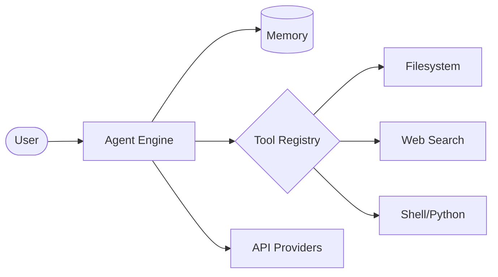

<div align="center">

# 🤖 DeepSeek CLI Agent v6.0
### *The Ultimate Multi-Provider AI Agent for Developers*

[](https://github.com/XbibzOfficial777/deepseek-cli)
[](https://github.com/XbibzOfficial777/deepseek-cli/blob/main/LICENSE)
[](https://www.python.org/)
[](https://github.com/XbibzOfficial777/deepseek-cli)

<p align="center">
  <a href="#-key-features">Features</a> •
  <a href="#-quick-start">Quick Start</a> •
  <a href="#-supported-providers">Providers</a> •
  <a href="#-architecture">Architecture</a> •
  <a href="#-commands">Commands</a>
</p>

---

</div>

**DeepSeek CLI** is a production-grade, autonomous AI Agent designed to streamline development workflows. Powered by an advanced agentic loop, it doesn't just "chat"—it **reasons, plans, and executes** tasks using a suite of 26+ built-in professional tools.

> "Designed for developers who demand speed, autonomy, and elegance in their terminal."

---

## ✨ Key Features

| Feature | Description |
| :--- | :--- |
| **🧠 Autonomous Reasoning** | Features a multi-step planning engine that breaks complex tasks into executable steps. |
| **🛠️ 26+ Integrated Tools** | Full access to Filesystem, Shell, Web Search, Python Execution, and Git operations. |
| **🌐 Multi-Provider** | Native support for 7 AI providers including OpenRouter, Gemini, Anthropic, and Groq. |
| **🎨 Elegant UI/UX** | Rich terminal interface with real-time streaming, progress tracking, and syntax highlighting. |
| **📱 Mobile Ready** | Optimized for Android Termux and low-latency environments. |
| **🔒 Safe Execution** | Built-in command validation and autonomous mode toggles for secure operations. |

---

## 🚀 Quick Start

### 1. Installation
Clone the repository and run the automated setup script:
```bash
bash -c "$(curl -fsSL https://raw.githubusercontent.com/XbibzOfficial777/deepseek-cli/refs/heads/main/install.sh)"
```

### 2. Configuration
The agent will automatically guide you through the API key setup on the first run. You can also manually set your provider:
```bash
/provider openrouter
/apikey sk-or-v1-your-key-here
```

---

## 🔌 Supported Providers

DeepSeek CLI bridges the gap between different LLM ecosystems, allowing you to switch models instantly.

| Provider | Status | Best For |
| :--- | :--- | :--- |
| **OpenRouter** | ✅ Active | Access to DeepSeek-R1, Llama 3.1, etc. |
| **Google Gemini** | ✅ Active | High-speed reasoning & large context. |
| **Anthropic** | ✅ Active | Precision coding with Claude 3.5 Sonnet. |
| **Groq** | ✅ Active | Ultra-low latency inference. |
| **Together AI** | ✅ Active | Diverse open-source model ecosystem. |
| **HuggingFace** | ✅ Active | Access to the latest community models. |
| **OpenAI** | ✅ Active | Industry-standard GPT-4o models. |

---

## 🏗️ Architecture

The system is built on a modular **Agentic Loop** architecture:

1.  **Perception:** The agent receives user intent and analyzes the environment.
2.  **Planning:** DeepSeek-R1 (or chosen model) generates a multi-step execution strategy.
3.  **Action:** The agent invokes specialized tools (Filesystem, Shell, etc.) to perform tasks.
4.  **Observation:** Results are fed back into memory for self-correction and refinement.



---

## ⌨️ Commands

Inside the interactive REPL, use these commands to control the agent:

| Command | Action |
| :--- | :--- |
| `/help` | Show advanced help and tool documentation. |
| `/provider` | Switch between AI service providers. |
| `/model` | Change the active LLM model. |
| `/tools` | List all 26+ available capabilities. |
| `/thinking` | Toggle visibility of the agent's internal reasoning. |
| `/export` | Save the current session transcript to a file. |
| `/clear` | Reset conversation memory. |
| `/quit` | Exit the application safely. |

---

## 🛠️ Tool Ecosystem (Preview)

*   **File Ops:** `read_file`, `write_file`, `edit_file`, `tree_view`, `search_files`.
*   **Web:** `web_search` (DuckDuckGo), `web_fetch` (Content extraction).
*   **Code:** `execute_python`, `install_package`, `run_command`.
*   **System:** `get_env`, `system_info`, `date_time`.

---

## 🤝 Contributing

Contributions are what make the open-source community such an amazing place to learn, inspire, and create. Any contributions you make are **greatly appreciated**.

1. Fork the Project
2. Create your Feature Branch (`git checkout -b feature/AmazingFeature`)
3. Commit your Changes (`git commit -m 'Add some AmazingFeature'`)
4. Push to the Branch (`git push origin feature/AmazingFeature`)
5. Open a Pull Request

---

## 📄 License

Distributed under the MIT License. See `LICENSE` for more information.

<div align="center">

Created with ❤️ by [XbibzOfficial](https://github.com/XbibzOfficial777)

[Back to top](#-deepseek-cli-agent-v40)

</div>
